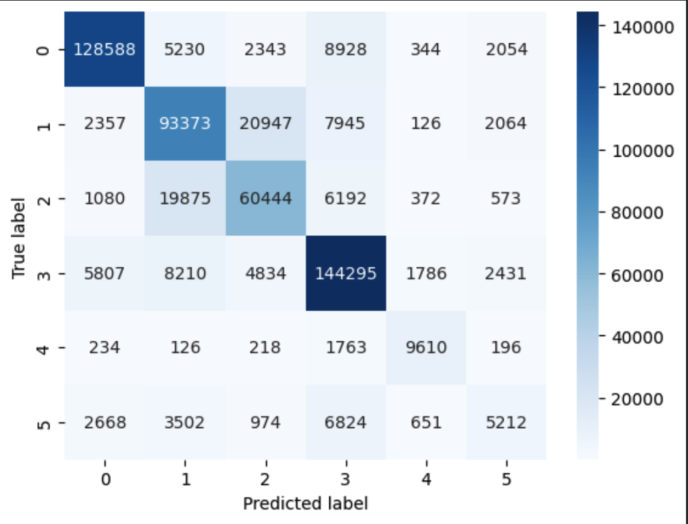
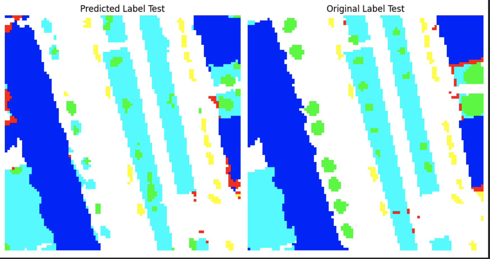
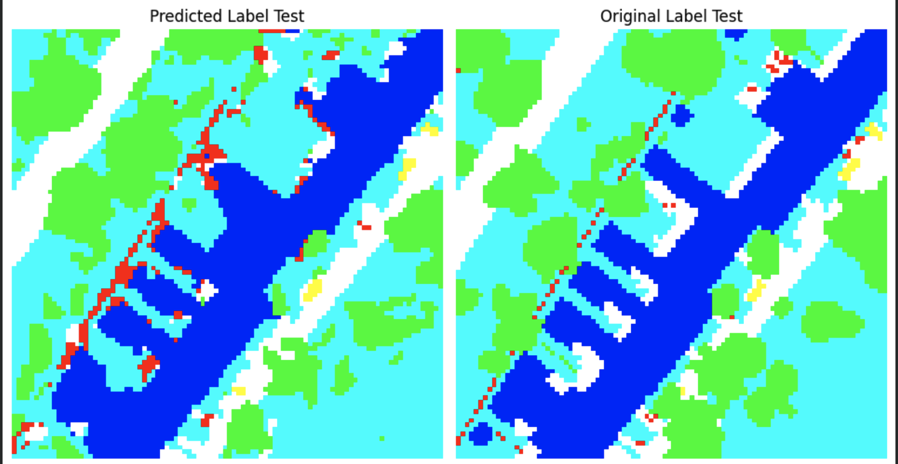

# Urban Object Extraction Dataset

## Introduction:

Semantic segmentation is a fundamental task in computer vision that aims to assign a specific class label to each pixel in an image. Unlike object detection or classification, which focus on identifying objects or predicting labels for the entire image, semantic segmentation provides a detailed understanding of the image at the pixel level. By segmenting an image into distinct regions corresponding to different object classes or semantic categories, semantic segmentation enables advanced visual understanding and scene analysis.

In semantic segmentation, the goal is to create a pixel-wise prediction map that accurately delineates the boundaries and regions of different objects or semantic concepts within an image. This fine-grained level of analysis allows for precise localization and identification of objects, making it a crucial task in applications such as autonomous driving, image editing, virtual reality, and medical image analysis.

Achieving accurate and robust semantic segmentation requires the development of sophisticated deep learning models capable of capturing the intricate details and spatial dependencies present in images. By leveraging powerful convolutional neural networks (CNNs) and advanced architectural designs, researchers have made significant progress in semantic segmentation, pushing the boundaries of what computers can perceive and understand in visual data.

However, along with model development, the quality and suitability of the dataset used for training are of utmost importance. Cleaning and preparing the dataset is a critical step to ensure that the model learns from reliable and representative examples. By addressing challenges like noisy annotations, class imbalance, and inconsistent labeling, we can enhance the dataset's quality, leading to improved model performance and generalization.

In this project, our objective is to construct a neural network model for semantic segmentation and train it on a meticulously curated dataset. By focusing on both the model architecture and the dataset preprocessing, we aim to achieve state-of-the-art performance in semantic segmentation while contributing to the broader advancement of computer vision research and applications.

## Objective:

The objective of this project is to develop a neural network model for semantic segmentation and train it on a carefully prepared dataset. In addition to implementing the model, a significant part of the project involves the data preprocessing stage, where we focus on cleaning and preparing the dataset to optimize the model's performance. By meticulously examining and addressing potential issues such as noise, class imbalance, and inconsistent annotations, we aim to create a high-quality dataset that can effectively train the neural network model for accurate and robust semantic segmentation. Through this project, we strive to improve the state-of-the-art in semantic segmentation and contribute to the advancement of computer vision research and applications.
 

## Dataset

This dataset consists of high-resolution aerial data containing a variety of urban objects. Six categories/classes have been defined:

- Impervious surfaces (RGB: 255, 255, 255)
- Building (RGB: 0, 0, 255)
- Low vegetation (RGB: 0, 255, 255)
- Tree (RGB: 0, 255, 0)
- Car (RGB: 255, 255, 0)
- Clutter/background (RGB: 255, 0, 0)

## Usage

This dataset can be used by researchers and developers to:

- Develop and test algorithms for urban object detection and classification.
- Develop and test algorithms for building reconstruction.
- Evaluate the performance of algorithms on high-resolution aerial data.
- Understand the context information of urban objects for improved extraction results.

## Getting Started

1. Clone this repository to your local machine.
    ```sh
    git clone https://github.com/giumanuz/Sematic-Segmentation-on-Podsdam-ISPRS
    ```

2. Navigate to the directory.
    ```sh
    cd urban-object-extraction-dataset
    ```

3. [Download the dataset](https://www.isprs.org/education/benchmarks/UrbanSemLab/default.aspx). The dataset is organized into different directories representing various urban object classes. Please refer to the documentation for the structure and description of the dataset.

4. The original images in the dataset are cropped into smaller images. By default, each image is cropped into 16 smaller images. However, you can use the provided code in `crop_image.py` to crop the images into an arbitrary number of smaller images.

5. The `split_images.py` script is used to create the training, testing, and validation datasets. You can set arbitrary proportions for splitting the dataset. By default the dataset is split into 80% training, 10% testing, and 10% validation.

6. Use the data as per your research or project requirements. Please make sure to cite this dataset if you use it in your research or project.

## Results and Evaluation

### Accuracy

Using the provided dataset and running the model for 100 epochs, an accuracy of approximately 79% is achieved. The performance can vary based on different parameters and configurations, but this gives a baseline of what to expect with the current settings.

### Confusion Matrix

A confusion matrix is essential for understanding how the model performs in classifying different urban objects. Below is the confusion matrix obtained from running the model with the given dataset:

<div align="center">
    
</div>

### Sample Predicted and Output Labels

Here are sample images showing the predicted labels and the actual output labels obtained using the model. These examples provide a visual representation of how the model performs in classifying urban objects:

**Example with resize from 1500x1500 to 96x96:**
<div align="center">
    
</div>

**Second example:**
<div align="center">
    
</div>


## Contributing

We welcome contributions to this dataset. If you have suggestions, corrections, or additions to the dataset, please submit a pull request or create an issue.


## License

This dataset is released under the MIT License. See the `LICENSE` file for more information.

## Contact

- Giulio Manuzzi
- giuliomanuzzi@gmail.com

Feel free to reach out if you have any questions or need further information. Happy coding!
